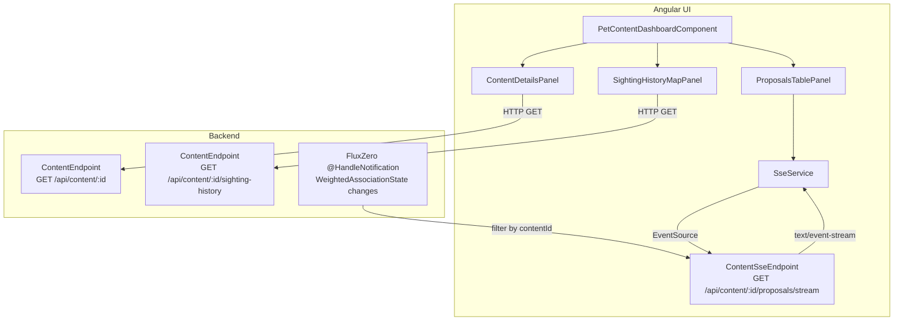

# Design Document

## Overview

The Pet Content SSE Dashboard replaces the existing WebSocket-based `UiUpdateSocketEndpoint` push pattern with Server-Sent Events (SSE) for a dedicated pet content detail screen. The dashboard is a three-panel Angular standalone component at route `/contents/:id` that shows:

1. **Content Details Panel** (top-left) — Pet-specific fields from the Content aggregate
2. **Sighting History Map** (top-right) — Mapbox GL JS map with chronological sighting markers from `GetSightingHistoryForContent`
3. **Proposals Table** (bottom half) — Real-time `WeightedAssociationState` table fed by an SSE stream

The backend introduces a new SSE endpoint using Spring Boot `SseEmitter` that subscribes to FluxZero `@HandleNotification` events for `WeightedAssociationState` changes scoped to a single `ContentId`. A new REST endpoint exposes sighting history. The frontend introduces an `SseService` that wraps the browser `EventSource` API with reconnection logic and exposes an RxJS Observable of typed SSE events.

### Key Design Decisions

1. **SSE over WebSocket**: SSE is a better fit here because the data flow is unidirectional (server → client). SSE provides automatic reconnection via `Last-Event-ID`, simpler infrastructure (standard HTTP), and native browser support through `EventSource`. The existing WebSocket endpoint remains for other use cases.
2. **SseEmitter per connection**: Each client connection gets its own `SseEmitter` instance. A `ConcurrentHashMap` keyed by `ContentId` holds sets of active emitters, allowing efficient fan-out when a notification arrives.
3. **Snapshot + delta pattern**: On connection, the endpoint sends a `snapshot` event with all current `WeightedAssociationState` records. Subsequent changes arrive as `update` events. This avoids race conditions between initial load and live updates.
4. **Monotonic event IDs**: Each SSE event carries a monotonically increasing `id` so the client can resume via `Last-Event-ID` after reconnection. The endpoint uses an `AtomicLong` per emitter.
5. **Reuse of existing `TrackRejoiceDataSource`**: The proposals table uses the same `DataSource` pattern as `WeightedAssociationsComponent`, applying mutations (add/update/remove) reactively.
6. **Mapbox reuse**: The sighting history map reuses Mapbox GL JS (already a project dependency from the content creation journey's `MapboxLocationPickerComponent`).

## Architecture



## Components and Interfaces

### Backend Components

#### ContentSseEndpoint (new)
- **Location**: `app/src/main/java/com/breece/app/web/ContentSseEndpoint.java`
- **Annotations**: `@Component`, `@Path("/api/content")`
- **Responsibilities**:
  - `@HandleGet("{contentId}/proposals/stream")` — Creates an `SseEmitter` (timeout 0 = infinite), authenticates the user, validates content ownership, sends initial snapshot, registers the emitter in the active connections registry.
  - `@HandleNotification` on `Entity<WeightedAssociationState>` — Filters by `contentId`, serializes the change, and writes to all registered emitters for that content.
  - Cleanup on emitter completion/timeout/error — removes emitter from registry.
- **Active connections registry**: `ConcurrentHashMap<String, Set<SseEmitter>>` where key is `contentId` string.
- **Event ID tracking**: `ConcurrentHashMap<SseEmitter, AtomicLong>` for per-emitter monotonic IDs.

#### ContentEndpoint (extended)
- **New method**: `@HandleGet("{contentId}/sighting-history")` — Executes `GetSightingHistoryForContent` query and returns `List<KeyValuePair>`.

### Frontend Components

#### PetContentDashboardComponent (new)
- **Selector**: `track-rejoice-pet-content-dashboard`
- **Route**: `/contents/:id` (protected by `authGuard`)
- **Responsibility**: Reads `id` from route params, passes it to the three child panels. Fetches Content aggregate on init. Shows 404 error if content not found.
- **Layout**: CSS Grid — two columns top half, full-width bottom half.

#### ContentDetailsPanelComponent (new)
- **Selector**: `track-rejoice-content-details-panel`
- **Inputs**: `@Input() content: Content`
- **Responsibility**: Renders Pet-specific fields (name, breed, gender, age, size, color, condition, description, image) and content-level fields (online status, duration). Shows fallback message if `ExtraDetails` type is not `Pet`. Renders image with alt text `"{name} - {breed}"`.

#### SightingHistoryMapComponent (new)
- **Selector**: `track-rejoice-sighting-history-map`
- **Inputs**: `@Input() contentId: string`, `@Input() lastConfirmedSighting: SightingDetails | null`
- **Responsibility**: Fetches sighting history via `GET /api/content/{contentId}/sighting-history`. Renders Mapbox GL JS map with markers at each sighting coordinate, connected by a chronological polyline. Fits bounds to markers. Shows popup with timestamp on marker click. Falls back to `lastConfirmedSighting` center if history is empty. Shows placeholder if no location data at all.

#### ProposalsTableComponent (new)
- **Selector**: `track-rejoice-proposals-table`
- **Inputs**: `@Input() contentId: string`
- **Responsibility**: Connects to SSE endpoint via `SseService`. Populates `TrackRejoiceDataSource<WeightedAssociationState>` from snapshot. Applies CREATED/UPDATED/DELETED mutations from update events. Highlights rows for 2 seconds after add/update. Shows disconnection indicator. Uses Angular Material table with columns: `weightedAssociationId`, `sightingId`, `status`, `distance`, `score`.

#### SseService (new)
- **Location**: `ui/src/app/common/sse.service.ts`
- **Injectable**: root-level singleton
- **API**:
  ```typescript
  connect(url: string): Observable<SseEvent>
  ```
- **Behavior**: Creates `EventSource`, maps `onmessage`/`onerror`/named events to an RxJS Observable. On error, implements exponential backoff reconnection (1s → 2s → 4s → ... → 30s max). Sends `Last-Event-ID` header on reconnect. Emits a `DISCONNECTED` status event while reconnecting. Requests fresh snapshot on reconnection. Completes the Observable when explicitly closed.
- **Cleanup**: Closes `EventSource` on Observable unsubscribe (tied to component `DestroyRef`).

### API Contracts

#### GET /api/content/{contentId}/proposals/stream (new — SSE)
- **Content-Type**: `text/event-stream`
- **Auth**: Required (same JWT mechanism as other endpoints)
- **Events**:
  - `event: snapshot` — `data: [{ changeType: "INITIAL", payload: WeightedAssociationState }, ...]`
  - `event: update` — `data: { changeType: "CREATED"|"UPDATED"|"DELETED", payload: WeightedAssociationState | { weightedAssociationId: string } }`
  - Each event has an `id` field (monotonically increasing integer)
- **Errors**: 403 if unauthorized, 404 if content not found

#### GET /api/content/{contentId}/sighting-history (new — REST)
- **Response**: `KeyValuePair[]` where `key` is timestamp, `value` is `SightingDetails`
- **Auth**: Required
- **Errors**: 404 if content not found

#### GET /api/content/{contentId} (existing)
- **Response**: `Content` aggregate

### SSE Event DTO

```java
public record SseEventData(ChangeType changeType, Object payload) {
    public enum ChangeType { INITIAL, CREATED, UPDATED, DELETED }
}
```

## Data Models

### Existing Models (no changes)

| Model | Module | Key Fields |
|---|---|---|
| `Content` | content | `contentId`, `lastConfirmedSighting`, `details` (ExtraDetails), `ownerId`, `online`, `duration`, `weightedAssociations` |
| `Pet` extends `MobileTarget` extends `ExtraDetails` | content | `name`, `breed`, `gender`, `subtype`, `age`, `size`, `color`, `condition`, `description`, `location`, `image` |
| `WeightedAssociationState` | content/proposal | `weightedAssociationId`, `contentId`, `sightingId`, `sightingDetails`, `status` (CREATED/LINKED/ACCEPTED/REJECTED), `distance`, `score` |
| `SightingDetails` | core-api | `lng: BigDecimal`, `lat: BigDecimal` |
| `KeyValuePair` | content/query | `key: Object`, `value: Object` |
| `WeightedAssociationStatus` | content/proposal | `CREATED`, `LINKED`, `ACCEPTED`, `REJECTED` |

### New Models

#### SseEventData (Java — app module)
- **Location**: `app/src/main/java/com/breece/app/web/api/SseEventData.java`
- **Fields**: `changeType: ChangeType`, `payload: Object`
- **ChangeType enum**: `INITIAL`, `CREATED`, `UPDATED`, `DELETED`

#### SseEvent (TypeScript — frontend)
- **Location**: `ui/src/app/common/sse-event.model.ts`
- **Fields**: `changeType: 'INITIAL' | 'CREATED' | 'UPDATED' | 'DELETED'`, `payload: WeightedAssociationState | { weightedAssociationId: string } | null`

### Auto-Generated TypeScript Models

`WeightedAssociationState`, `Content`, `Pet`, `SightingDetails`, `KeyValuePair`, and `WeightedAssociationStatus` are already generated into `@trackrejoice/typescriptmodels`. The new `SseEventData` Java record will also be picked up by the typescript-generator on next build.


## Correctness Properties

*A property is a characteristic or behavior that should hold true across all valid executions of a system — essentially, a formal statement about what the system should do. Properties serve as the bridge between human-readable specifications and machine-verifiable correctness guarantees.*

### Property 1: SSE snapshot contains all current WeightedAssociationState records

*For any* set of `WeightedAssociationState` records associated with a given `ContentId`, when a client connects to the SSE endpoint, the initial `snapshot` event SHALL contain exactly those records with `changeType` `INITIAL`, and no records belonging to other content IDs.

**Validates: Requirements 1.2, 8.2**

### Property 2: Notification forwarding filters by ContentId and preserves payload

*For any* `WeightedAssociationState` entity change notification, the SSE endpoint SHALL forward it as an `update` event only to connected clients subscribed to the matching `contentId`, and SHALL NOT forward it to clients subscribed to a different `contentId`. The forwarded event SHALL contain the correct `changeType` (`CREATED`, `UPDATED`, or `DELETED`) and a JSON object with `changeType` and `payload` fields — where `payload` is the full `WeightedAssociationState` record for creates/updates, or only the `weightedAssociationId` for deletions.

**Validates: Requirements 1.3, 2.1, 2.2, 8.2, 8.3**

### Property 3: SSE event IDs are monotonically increasing

*For any* sequence of SSE events sent to a single client connection, each event's `id` field SHALL be a strictly increasing integer compared to the previous event's `id` field.

**Validates: Requirements 1.5**

### Property 4: BigDecimal coordinate serialization round-trip preserves precision

*For any* `SightingDetails` with `BigDecimal` lng and lat values, serializing to JSON as part of an SSE event payload and deserializing back SHALL produce values equal to the originals (using `compareTo` equality).

**Validates: Requirements 2.3**

### Property 5: Route parameter propagates to all dashboard panels

*For any* `ContentId` string provided as the `:id` route parameter, the dashboard SHALL pass that exact string to the Content Details Panel, Sighting History Map, and Proposals Table as their `contentId` input.

**Validates: Requirements 3.2**

### Property 6: Content details panel renders all required fields

*For any* `Content` aggregate where `ExtraDetails` is of type `Pet`, the Content Details Panel SHALL render the pet name, breed, gender, age, size, color, condition, description, the content online status, and the content duration. If the image field is non-null, the rendered image alt text SHALL contain both the pet name and breed.

**Validates: Requirements 4.2, 4.3, 4.4, 4.6**

### Property 7: Proposals table snapshot populates all rows with correct columns

*For any* set of `WeightedAssociationState` records received in a `snapshot` SSE event, the Proposals Table SHALL display exactly that many rows, and each row SHALL contain the `weightedAssociationId`, `sightingId`, `status`, `distance`, and `score` values from the corresponding record.

**Validates: Requirements 6.1, 6.2**

### Property 8: Proposals table mutations produce correct final state

*For any* initial set of `WeightedAssociationState` records and any sequence of SSE mutation events (`CREATED`, `UPDATED`, `DELETED`), the Proposals Table state after applying all mutations SHALL equal the expected state: CREATED events append new rows, UPDATED events replace matching rows by `weightedAssociationId`, and DELETED events remove matching rows by `weightedAssociationId`.

**Validates: Requirements 6.3, 6.4, 6.5**

### Property 9: Exponential backoff delay sequence

*For any* number of consecutive SSE reconnection failures `n` (where n ≥ 1), the reconnection delay SHALL equal `min(2^(n-1), 30)` seconds — starting at 1 second, doubling each attempt, and capping at 30 seconds.

**Validates: Requirements 7.2**

## Error Handling

### Backend Error Handling

| Scenario | Behavior |
|---|---|
| SSE request for non-existent ContentId | Return HTTP 404 |
| SSE request by unauthorized user | Return HTTP 403 |
| SseEmitter timeout | Remove emitter from active connections registry, clean up notification subscription |
| SseEmitter I/O error (client disconnect) | Remove emitter from registry, log warning |
| Sighting history for non-existent ContentId | Return HTTP 404 |
| Notification serialization failure | Log error, skip event (do not crash emitter) |

### Frontend Error Handling

| Scenario | Behavior |
|---|---|
| Content GET returns 404 | Dashboard shows "Content not found" error message |
| Content GET returns other error | Dashboard shows generic error with retry option |
| SSE connection drops | `SseService` reconnects with exponential backoff; Proposals Table shows disconnection indicator |
| SSE reconnection succeeds | Request fresh snapshot to reconcile missed events; hide disconnection indicator |
| Sighting history GET fails | Map panel shows error message with retry option |
| Mapbox GL JS fails to load | Map panel shows placeholder message |
| Non-Pet ExtraDetails type | Content Details Panel shows fallback message |

## Testing Strategy

### Property-Based Tests

Property-based testing applies to this feature for SSE event serialization, table mutation logic, backoff calculation, and component data binding. Use `fast-check` as the PBT library for TypeScript/Angular tests and `jqwik` for Java backend tests.

Each property test MUST:
- Run a minimum of 100 iterations
- Reference the design property via tag comment
- Format: `Feature: pet-content-sse-dashboard, Property {number}: {title}`

**Backend properties (jqwik):**
1. **Property 1**: Generate random sets of WeightedAssociationState, verify snapshot event contains exactly those records.
2. **Property 2**: Generate random notifications with varying contentIds, verify only matching ones are forwarded with correct changeType/payload.
3. **Property 3**: Generate random event sequences, verify IDs are strictly monotonically increasing.
4. **Property 4**: Generate random BigDecimal coordinate pairs, serialize/deserialize, verify equality.

**Frontend properties (fast-check):**
5. **Property 5**: Generate random ContentId strings, verify route param propagation to all child components.
6. **Property 6**: Generate random Content objects with Pet details, verify all fields rendered.
7. **Property 7**: Generate random WeightedAssociationState arrays, verify table row count and column values.
8. **Property 8**: Generate random initial state + random mutation sequences, verify final table state matches expected.
9. **Property 9**: Generate random failure counts (1–50), verify delay equals `min(2^(n-1), 30)`.

### Unit Tests (Example-Based)

- **ContentSseEndpoint**: 403 for unauthorized user, 404 for non-existent content, resource cleanup on client disconnect, emitter cleanup on timeout.
- **ContentEndpoint (sighting-history)**: 404 for non-existent content, auth required.
- **PetContentDashboardComponent**: Three panels rendered, error message on 404, authGuard on route.
- **ContentDetailsPanelComponent**: Fallback message for non-Pet content, image alt text format.
- **SightingHistoryMapComponent**: Marker click shows timestamp popup, empty history centers on lastConfirmedSighting, no location data shows placeholder.
- **ProposalsTableComponent**: Row highlight CSS class applied on add/update, disconnection indicator shown during reconnection, Angular Material table components used.
- **SseService**: EventSource closed on unsubscribe, Last-Event-ID sent on reconnect, fresh snapshot requested after reconnection.

### Integration Tests

- **SSE endpoint end-to-end**: Connect, receive snapshot, trigger a WeightedAssociationState change, verify update event received.
- **Sighting history endpoint**: Seed sighting events, query endpoint, verify correct KeyValuePair list returned.
- **Mapbox rendering**: Verify markers added for sighting coordinates, polyline connects markers chronologically, fitBounds called.
